# codex-pets

Mascotas personalizadas en formato **`.codex-pet`** para el IDE Orca (y cualquier app que entienda el mismo formato). Cada mascota reacciona a lo que hacen tus agentes: trabaja cuando ellos trabajan, espera cuando necesitan input, revisa cuando terminan y entra en pánico cuando algo falla.

## Galería

| Barbaroot HD | Barbaroot Rider | Capi |
|:---:|:---:|:---:|
|  | 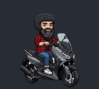 | 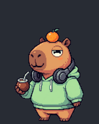 |
| Hacker hipster calvo, barba negra con canas, franela y café de especialidad. | Barbaroot en su maxi scooter: casco jet, caballitos y humo cuando algo peta. | Capibara zen con mate, cascos y una mandarina en la cabeza. |

| Neko.exe | Kraken | Prodzilla |
|:---:|:---:|:---:|
| 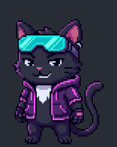 | 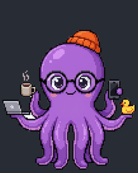 | 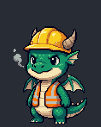 |
| Gato hacker cyberpunk con visor neón y sudadera morada. | Pulpo multitarea: un portátil por tentáculo y patito de goma para debuggear. | Dragoncito guardián de producción. Si algo falla, echa fuego. |

| Patito Debug | Pager | Dockerina |
|:---:|:---:|:---:|
| 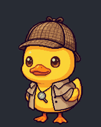 | 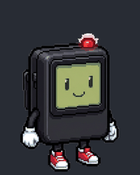 | 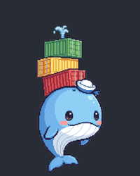 |
| Patito de goma detective para hacer rubber-duck debugging, con gabardina y lupa. | El busca de guardia: bosteza esperando y vibra en rojo cuando salta una alerta. | Ballenita que apila contenedores en el lomo y se le desmoronan cuando algo falla. |

| Bitbot | Barbaroot (pixel) | Pikorca |
|:---:|:---:|:---:|
| 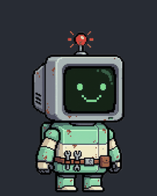 |  |  |
| Robot retro con un monitor CRT por cara que cambia según el estado. | El Barbaroot original en pixel art de 48×52 dibujado por código. | Orca SRE de guardia con auriculares, lupa y timón de Helm. |

| Unicornio | Unicornio Toon |
|:---:|:---:|
| 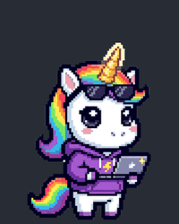 | 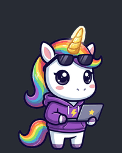 |
| Unicornio dev con sudadera, gafas de sol y crin arcoíris. Se le chamusca la crin cuando algo falla. | El mismo unicornio en versión ilustrada, sin píxeles. |

## Instalación en Orca

1. Descarga la carpeta de la mascota que quieras de [`pets/`](pets/). Por ejemplo, `pets/barbaroot-hd.codex-pet/` (necesitas los dos ficheros: `pet.json` y `spritesheet.webp`).
2. En Orca, abre el **Pet menu** desde la barra de estado inferior.
3. Elige **Import .codex-pet bundle…** y selecciona la carpeta `*.codex-pet`.
4. Selecciónala en **Choose pet**.

> `Upload your own…` es para una imagen suelta (PNG, GIF, WebP, SVG…) sin animaciones por estado. Para estas mascotas usa siempre la importación de bundle.

## Formato `.codex-pet`

Un bundle es una carpeta con un manifiesto y una hoja de sprites:

```
mi-mascota.codex-pet/
├── pet.json
└── spritesheet.webp   # también PNG, APNG, JPG o GIF
```

Cada **fila** de la hoja es una animación y cada **columna** un frame. Si `pet.json` no declara `frame` ni `animations`, Orca asume frames de **192×208** en una rejilla de **8×9** con estas filas:

| Fila | Animación | Cuándo se muestra | Frames |
|---:|---|---|---:|
| 0 | `idle` | En reposo | 6 |
| 1 | `running-right` | Al arrastrarla a la derecha | 8 |
| 2 | `running-left` | Al arrastrarla a la izquierda | 8 |
| 3 | `waving` | Saludo | 4 |
| 4 | `jumping` | Al pasar el ratón por encima | 5 |
| 5 | `failed` | Error | 8 |
| 6 | `waiting` | Un agente está bloqueado o esperando input | 6 |
| 7 | `running` | Un agente está trabajando | 6 |
| 8 | `review` | Un agente ha terminado y hay algo que revisar | 6 |

Manifiesto completo (todos los campos son opcionales):

```json
{
  "id": "mi-mascota",
  "displayName": "Mi Mascota",
  "description": "...",
  "spritesheetPath": "spritesheet.webp",
  "frame": { "width": 256, "height": 320 },
  "fps": 8,
  "defaultAnimation": "idle",
  "animations": {
    "idle": { "row": 0, "frames": 6, "frameDurationsMs": [1680, 660, 660, 840, 840, 1920] }
  }
}
```

Reglas que valida Orca al importar:

- La hoja tiene que ser un múltiplo exacto del tamaño de frame.
- Ninguna animación puede tener más frames que columnas tiene la hoja.
- `frameDurationsMs`, si se indica, debe tener tantos valores como frames.
- El frame no puede superar 1024 px por lado, la hoja 64 MB y `pet.json` 64 KB.

## Regenerar o crear mascotas

Los generadores están en [`generators/`](generators/) y solo necesitan [Pillow](https://pypi.org/project/pillow/):

```bash
python -m venv .venv && .venv/bin/pip install pillow

# Pixel art dibujado por código
.venv/bin/python generators/pikorca.py   pets/pikorca.codex-pet   /tmp/pikorca.png
.venv/bin/python generators/barbaroot.py pets/barbaroot.codex-pet /tmp/barbaroot.png

# Mascotas HD a partir de sus poses ilustradas (generators/hd/<mascota>/)
.venv/bin/python generators/build_hd.py generators/hd/capi pets/capi.codex-pet /tmp/capi.png

# Vistas previas del README
.venv/bin/python generators/preview.py pets/capi.codex-pet docs/previews/capi
```

### Crear una mascota HD nueva

1. Genera **una pose por estado** con un modelo de imagen, sobre fondo blanco liso: `idle`, `working`, `review`, `wave`, `failed`, `waiting`, `jump` y `walk` (andando hacia la derecha). Para que el personaje no cambie, genera primero `idle` y úsala como referencia en las demás. Las de este repo se hicieron con Nano Banana Pro en [Magnific](https://www.magnific.com).
2. Guárdalas en `generators/hd/<mascota>/poses/<pose>.png` y añade un `meta.json`:

   ```json
   {
     "id": "mi-mascota",
     "displayName": "Mi Mascota",
     "description": "...",
     "frame": [256, 320],
     "steam": [22, 34],
     "jump_tilt": 0
   }
   ```

   - `frame` es opcional (por defecto 256×320). Usa uno más ancho para personajes apaisados, como el de la scooter (`[320, 288]`).
   - `steam` es opcional: dibuja vapor en esa posición de la rejilla de efectos (un píxel de efecto equivale a 4 px). Sirve para una taza de café.
   - `jump_tilt` es opcional: inclina la pose de salto, por ejemplo para hacer un caballito.
3. Ejecuta `build_hd.py`. Recorta el fondo, escala todas las poses por igual, las anima (rebote, respiración, temblores y saltos) y añade efectos en pixel art: bits, bocadillos, ✅, "!", humo, estrellas y corazones.

## Licencia

[MIT](LICENSE)
